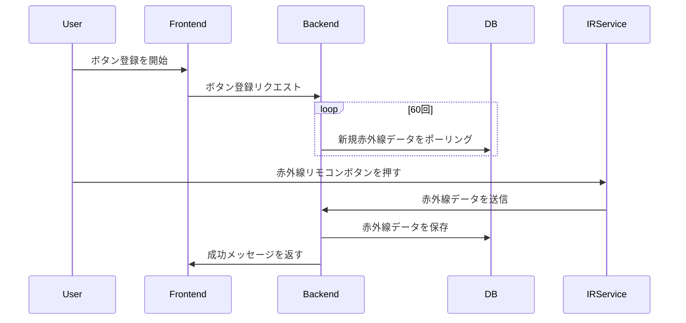
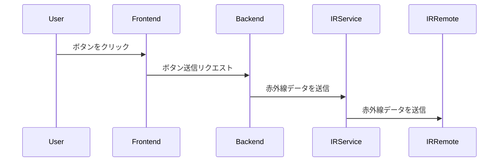

# 赤外線リモコン管理サービス

## シーケンス

### ボタン登録

```mermaid
sequenceDiagram
    participant User
    participant Frontend
    participant Backend
    participant DB
    participant IRService
    User ->> Frontend: ボタン登録を開始
    Frontend ->> Backend: ボタン登録リクエスト
    loop 60回
        Backend ->> DB: 新規赤外線データをポーリング
    end
    User ->> IRService: 赤外線リモコンボタンを押す
    IRService ->> Backend: 赤外線データを送信
    Backend ->> DB: 赤外線データを保存
    Backend ->> Frontend: 成功メッセージを返す
```

### ボタン送信

```mermaid
sequenceDiagram
    participant User
    participant Frontend
    participant Backend
    participant IRService
    User ->> Frontend: ボタンをクリック
    Frontend ->> Backend: ボタン送信リクエスト
    Backend ->> IRService: 赤外線データを送信
    IRService ->> IRRemote: 赤外線データを送信
```
